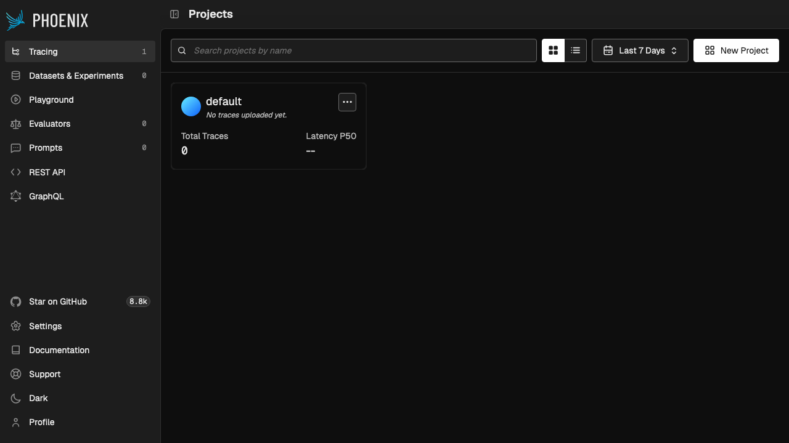
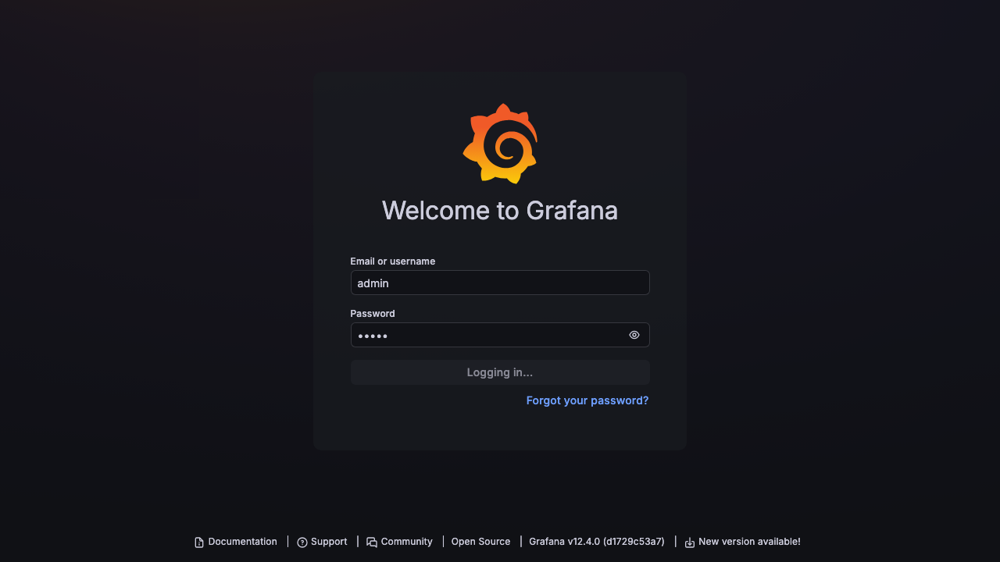
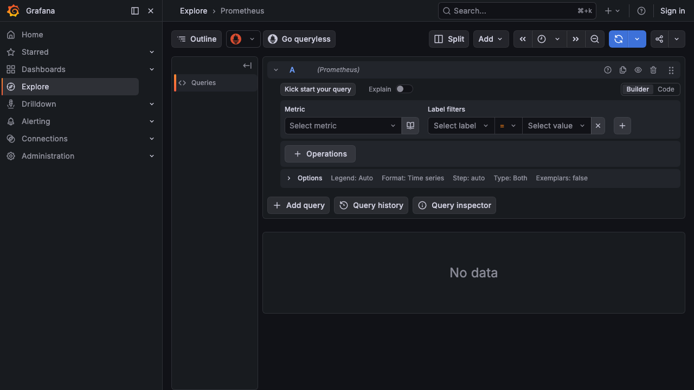
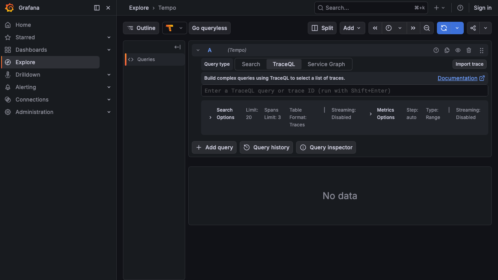
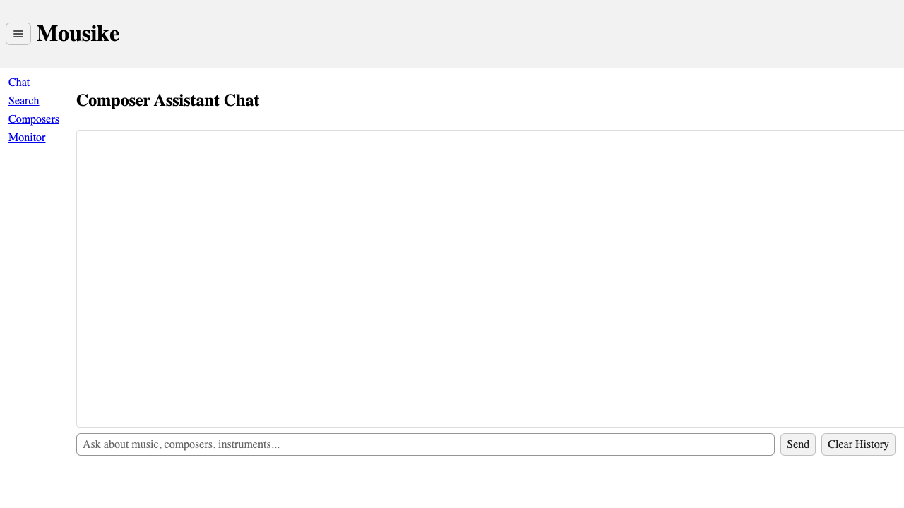
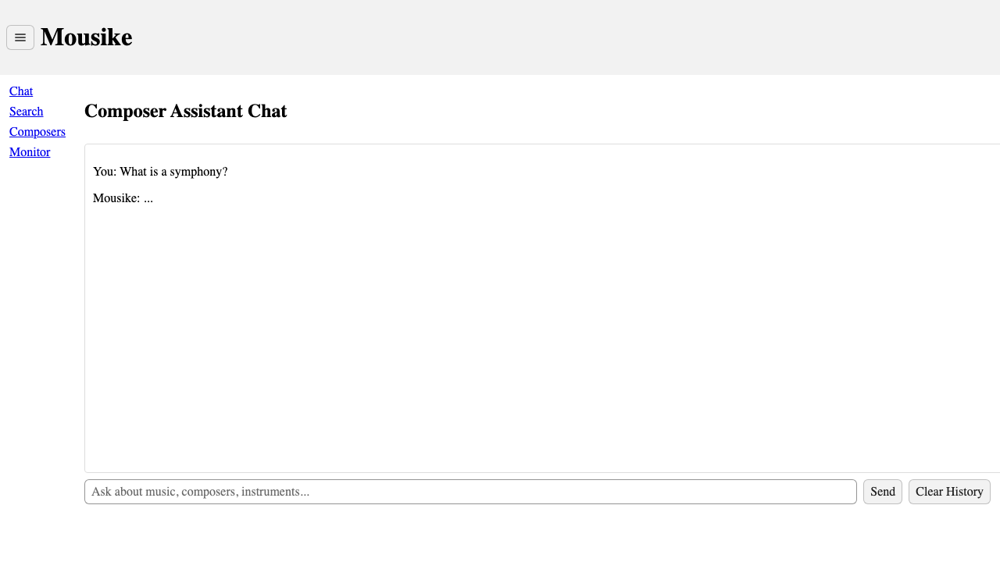
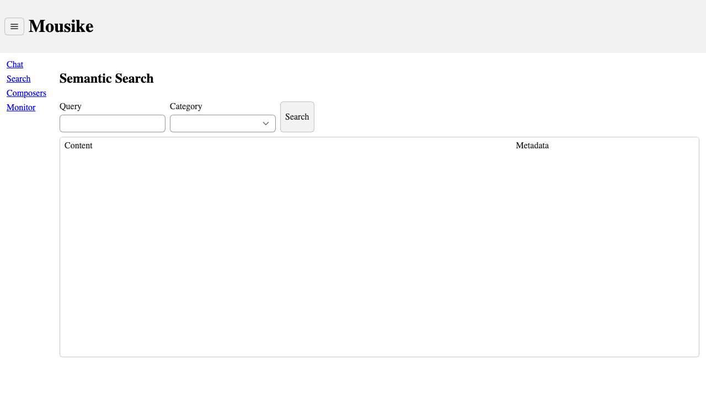
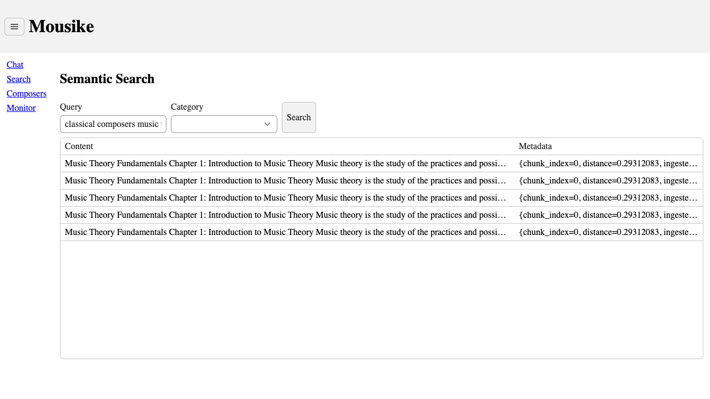
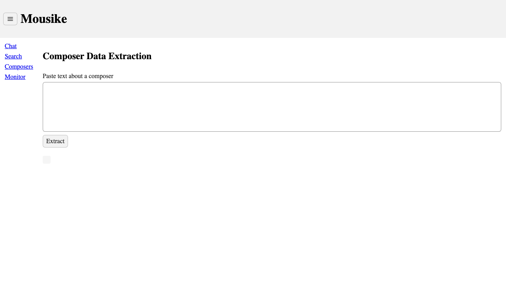
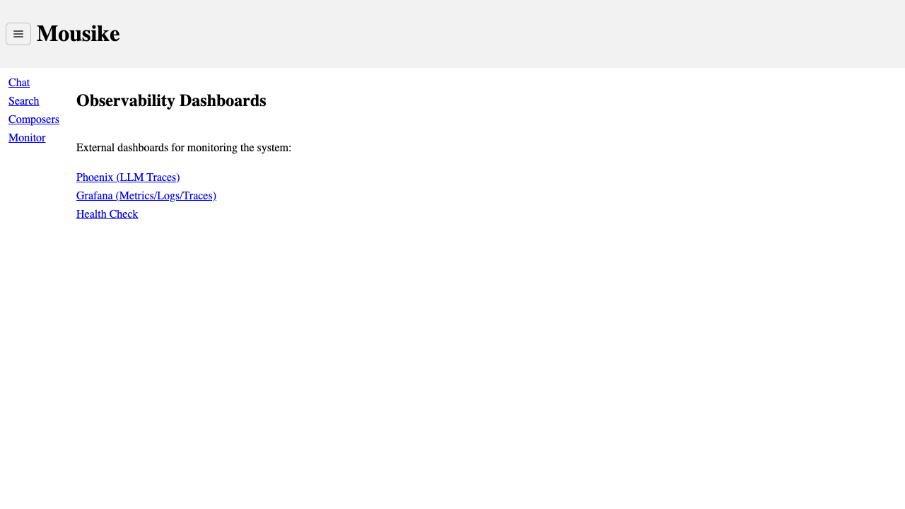

# Mousike — Manual Testing Guide

> Step-by-step manual testing procedures to validate the entire Mousike platform. Follow these tests in order — each section builds on the previous one.

---

## Table of Contents

1. [Prerequisites & Environment Check](#1-prerequisites--environment-check)
2. [Test 1: Infrastructure Health](#2-test-1-infrastructure-health)
3. [Test 2: Document Ingestion Pipeline](#3-test-2-document-ingestion-pipeline)
4. [Test 3: Semantic Vector Search](#4-test-3-semantic-vector-search)
5. [Test 4: LLM Chat & Conversation Memory](#5-test-4-llm-chat--conversation-memory)
6. [Test 5: RAG Pipeline (All 3 Modes)](#6-test-5-rag-pipeline-all-3-modes)
7. [Test 6: Anti-Hallucination Guardrails](#7-test-6-anti-hallucination-guardrails)
8. [Test 7: Instrument Classification](#8-test-7-instrument-classification)
9. [Test 8: Composer Data Extraction](#9-test-8-composer-data-extraction)
10. [Test 9: MCP Integration (Agentic Tools)](#10-test-9-mcp-integration-agentic-tools)
11. [Test 10: Observability & Metrics](#11-test-10-observability--metrics)
12. [Test 11: UI Comprehensive Walkthrough](#12-test-11-ui-comprehensive-walkthrough)
13. [Test 12: End-to-End Flow Validation](#13-test-12-end-to-end-flow-validation)
14. [Test Result Template](#14-test-result-template)

---

## 1. Prerequisites & Environment Check

Before starting manual testing, verify the environment is ready.

### Step 1.1: Verify all Kubernetes pods are running

```bash
kubectl get pods -n rag
```

**Expected**: All pods should show `Running` status with `1/1` ready:

```
NAME                                READY   STATUS    RESTARTS   AGE
docling-xxxxxxxxxx-xxxxx            1/1     Running   0          xxm
document-service-xxxxxxxxxx-xxxxx   1/1     Running   0          xxm
grafana-lgtm-xxxxxxxxxx-xxxxx      1/1     Running   0          xxm
mousike-xxxxxxxxxx-xxxxx            1/1     Running   0          xxm
phoenix-xxxxxxxxxx-xxxxx            1/1     Running   0          xxm
postgres-0                          1/1     Running   0          xxm
redis-xxxxxxxxxx-xxxxx              1/1     Running   0          xxm
```

**If pods are not running**: Check logs with `kubectl logs <pod-name> -n rag` and refer to Troubleshooting in the Product Manual.

### Step 1.2: Verify Ollama is running on host

```bash
curl http://localhost:11434/api/tags
```

**Expected**: JSON response listing `llama3.2` and `nomic-embed-text` models.

### Step 1.3: Verify port accessibility

```bash
curl -s http://localhost:8080/actuator/health | head -1    # mousike-app
curl -s http://localhost:8091/actuator/health | head -1    # document-service
curl -s http://localhost:6006/healthz                       # Phoenix
curl -s http://localhost:3000/api/health                    # Grafana
```

**Expected**: All should return `200 OK` or health status JSON.

---

## 2. Test 1: Infrastructure Health

**Objective**: Verify all infrastructure components are healthy and properly connected.

### Test 1.1: Mousike application health

```bash
curl -s http://localhost:8080/actuator/health | python3 -m json.tool
```

**Expected result**:
- `status`: `UP`
- `components.db.status`: `UP`
- `components.db.details.database`: `PostgreSQL`

**Screenshot reference**:

The health endpoint should return a response like:
```json
{
  "status": "UP",
  "components": {
    "db": {
      "status": "UP",
      "details": {
        "database": "PostgreSQL",
        "validationQuery": "isValid()"
      }
    },
    "diskSpace": { "status": "UP" },
    "livenessState": { "status": "UP" },
    "readinessState": { "status": "UP" }
  }
}
```

**Pass criteria**: ✅ Status is `UP`, database is `PostgreSQL`

### Test 1.2: Document-service health

```bash
curl -s http://localhost:8091/actuator/health | python3 -m json.tool
```

**Expected**: `status: UP`

**Pass criteria**: ✅ Status is `UP`

### Test 1.3: Phoenix health

```bash
curl -s http://localhost:6006/healthz
```

**Expected**: `OK`

**Pass criteria**: ✅ Returns `OK`

### Test 1.4: Grafana health

```bash
curl -s http://localhost:3000/api/health | python3 -m json.tool
```

**Expected**: `database: ok`

**Pass criteria**: ✅ `database` field is `ok`

### Test 1.5: Grafana datasources

```bash
curl -s http://localhost:3000/api/datasources -u admin:admin | python3 -c "
import sys, json
ds = json.load(sys.stdin)
for d in ds:
    print(f'  {d[\"name\"]:15s} type={d[\"type\"]:30s} uid={d[\"uid\"]}')"
```

**Expected**: Four datasources listed:
```
  Prometheus      type=prometheus                     uid=prometheus
  Tempo           type=tempo                          uid=tempo
  Loki            type=loki                           uid=loki
  Pyroscope       type=grafana-pyroscope-datasource   uid=pyroscope
```

**Pass criteria**: ✅ All four datasources present (Prometheus, Tempo, Loki, Pyroscope)

### Test 1.6: Prometheus metrics endpoint

```bash
curl -s http://localhost:8080/actuator/prometheus | grep "application=" | head -3
```

**Expected**: Lines containing `application="mousike"`

**Pass criteria**: ✅ Metrics contain `application="mousike"` tag

---

## 3. Test 2: Document Ingestion Pipeline

**Objective**: Verify that PDF documents can be uploaded, parsed, chunked, embedded, and stored in PGVector.

### Step 2.0: Create a test PDF

If you don't have a PDF ready, create one from the `e2e/` directory:

```bash
# Use a pre-existing test PDF
ls e2e/test-music-knowledge.pdf e2e/test-composers-guide.pdf
```

Or create one manually with any text editor, save as PDF with content about music.

### Test 2.1: Ingest first document

```bash
curl -s -X POST http://localhost:8091/api/ingest \
  -F "file=@e2e/test-music-knowledge.pdf" \
  -F "category=theory" | python3 -m json.tool
```

**Expected result**:
```json
{
  "filename": "test-music-knowledge.pdf",
  "chunksIngested": 1,
  "success": true,
  "error": ""
}
```

**Pass criteria**: ✅ `success: true`, `chunksIngested >= 1`

### Test 2.2: Ingest second document (different category)

```bash
curl -s -X POST http://localhost:8091/api/ingest \
  -F "file=@e2e/test-composers-guide.pdf" \
  -F "category=composers" | python3 -m json.tool
```

**Expected**: `success: true`

**Pass criteria**: ✅ Both documents ingested successfully

### Test 2.3: Verify documents endpoint

```bash
curl -s http://localhost:8091/api/documents | python3 -m json.tool
```

**Expected**: Returns JSON with `status: available`

**Pass criteria**: ✅ Endpoint returns 200

### Test 2.4: Verify embedding metrics increased

```bash
curl -s http://localhost:8080/actuator/prometheus | grep 'gen_ai_client_operation_seconds_count.*embedding.*error="none"'
```

**Expected**: Counter value > 0, confirming Ollama embedding model was called

**Pass criteria**: ✅ Embedding operation count > 0

---

## 4. Test 3: Semantic Vector Search

**Objective**: Verify that ingested documents are searchable via vector similarity.

### Test 3.1: Basic search

```bash
curl -s "http://localhost:8080/api/search?q=composers+classical+music+Bach+Beethoven+Mozart&topK=10" | python3 -m json.tool
```

**Expected**: Array of results with `content` and `metadata` fields. At least 1 result should be returned.

**Verify**:
- [ ] Results array is not empty
- [ ] Each result has `content` (document text)
- [ ] Each result has `metadata.source` (filename ending in `.pdf`)
- [ ] Each result has `metadata.distance` (number between 0 and 1)
- [ ] Each result has `metadata.category`

**Pass criteria**: ✅ At least 1 result returned with valid metadata

### Test 3.2: Category-filtered search

```bash
curl -s "http://localhost:8080/api/search?q=music+theory+scales&category=theory&topK=5" | python3 -m json.tool
```

**Expected**: Results where all documents have `category: "theory"`

**Pass criteria**: ✅ All results have matching category (or empty if no theory docs match)

### Test 3.3: Search with no results (out of domain)

```bash
curl -s "http://localhost:8080/api/search?q=quantum+physics+relativity&topK=5" | python3 -m json.tool
```

**Expected**: Empty array `[]` — no music documents should match physics queries

**Pass criteria**: ✅ Returns empty array

---

## 5. Test 4: LLM Chat & Conversation Memory

**Objective**: Verify that the LLM responds to questions and maintains conversation context.

### Test 4.1: Basic chat

```bash
curl -s -X POST http://localhost:8080/api/chat \
  -H "Content-Type: application/json" \
  -d '{"message": "Hello! What kind of assistant are you?", "conversationId": "manual-test-1"}' \
  | python3 -m json.tool
```

**Expected**:
- `response` is not empty and mentions music/Mousike
- `conversationId` matches `manual-test-1`

**Pass criteria**: ✅ Meaningful response received

### Test 4.2: Conversation memory — set context

```bash
curl -s -X POST http://localhost:8080/api/chat \
  -H "Content-Type: application/json" \
  -d '{"message": "My favorite instrument is the cello", "conversationId": "manual-test-1"}' \
  | python3 -m json.tool
```

**Expected**: Acknowledges the cello preference

### Test 4.3: Conversation memory — recall context

```bash
curl -s -X POST http://localhost:8080/api/chat \
  -H "Content-Type: application/json" \
  -d '{"message": "What is my favorite instrument?", "conversationId": "manual-test-1"}' \
  | python3 -m json.tool
```

**Expected**: Response mentions "cello"

**Pass criteria**: ✅ Response contains "cello" — proves JDBC chat memory is working

### Test 4.4: Memory isolation — different conversation

```bash
curl -s -X POST http://localhost:8080/api/chat \
  -H "Content-Type: application/json" \
  -d '{"message": "What is my favorite instrument?", "conversationId": "manual-test-2"}' \
  | python3 -m json.tool
```

**Expected**: Response does NOT mention "cello" — this is a separate conversation

**Pass criteria**: ✅ No mention of "cello" — conversations are isolated

### Test 4.5: Clear conversation memory

```bash
# Delete conversation
curl -s -X DELETE http://localhost:8080/api/chat/manual-test-1 -w "\nHTTP Status: %{http_code}\n"

# Verify memory is gone
curl -s -X POST http://localhost:8080/api/chat \
  -H "Content-Type: application/json" \
  -d '{"message": "What is my favorite instrument?", "conversationId": "manual-test-1"}' \
  | python3 -m json.tool
```

**Expected**: DELETE returns `204`, subsequent query does NOT remember "cello"

**Pass criteria**: ✅ HTTP 204 on delete, memory cleared

---

## 6. Test 5: RAG Pipeline (All 3 Modes)

**Objective**: Verify all three RAG modes retrieve and generate grounded answers.

> **Important**: These tests require documents to be ingested first (Test 2). Use broad, multi-word queries that match ingested content.

### Test 5.1: Naive RAG

```bash
curl -s -X POST "http://localhost:8080/api/rag/query?mode=naive" \
  -H "Content-Type: application/json" \
  -d '{"question": "Tell me about the famous classical composers Bach, Beethoven and Mozart and their major works"}' \
  | python3 -m json.tool
```

**Verify**:
- [ ] `mode` is `"naive"`
- [ ] `answer` is not the "no data" response
- [ ] Answer is relevant to the question

**Pass criteria**: ✅ Returns a substantive answer grounded in ingested documents

### Test 5.2: Advanced RAG (default mode)

```bash
curl -s -X POST "http://localhost:8080/api/rag/query?mode=advanced" \
  -H "Content-Type: application/json" \
  -d '{"question": "Tell me about the famous classical composers Bach, Beethoven and Mozart and their major works"}' \
  | python3 -m json.tool
```

**Verify**:
- [ ] `mode` is `"advanced"`
- [ ] Answer is substantive and grounded

**Pass criteria**: ✅ Returns grounded answer

### Test 5.3: Agentic RAG (MCP tools)

```bash
curl -s -X POST "http://localhost:8080/api/rag/query?mode=agentic" \
  -H "Content-Type: application/json" \
  -d '{"question": "Search the music knowledge base for information about classical composers"}' \
  | python3 -m json.tool
```

**Verify**:
- [ ] `mode` is `"agentic"`
- [ ] Answer contains information (LLM used MCP tools to search document-service)

**Pass criteria**: ✅ Agentic mode returns an answer (proves MCP client → server communication works)

---

## 7. Test 6: Anti-Hallucination Guardrails

**Objective**: Verify the 3-layer guardrails prevent hallucination for out-of-domain questions.

### Test 6.1: Out-of-domain question (should be blocked)

```bash
curl -s -X POST "http://localhost:8080/api/rag/query?mode=naive" \
  -H "Content-Type: application/json" \
  -d '{"question": "What is the population of Tokyo, Japan?"}' \
  | python3 -m json.tool
```

**Expected**:
```json
{
  "answer": "I don't have enough information in my knowledge base to answer that question accurately. Please try rephrasing your question or ask about a different music topic."
}
```

**Pass criteria**: ✅ Returns the "no data" response — guardrails prevented hallucination

### Test 6.2: Another out-of-domain question

```bash
curl -s -X POST "http://localhost:8080/api/rag/query?mode=advanced" \
  -H "Content-Type: application/json" \
  -d '{"question": "How do I write a Python web server?"}' \
  | python3 -m json.tool
```

**Expected**: Same "no data" response

**Pass criteria**: ✅ Guardrails active for both naive and advanced modes

---

## 8. Test 7: Instrument Classification

**Objective**: Verify the LLM can classify instrument descriptions into categories.

### Test 7.1: Classify a keyboard instrument

```bash
curl -s -X POST http://localhost:8080/api/classify \
  -H "Content-Type: application/json" \
  -d '{"description": "A large wooden instrument with 88 black and white keys that produces sound by hammers striking strings"}' \
  | python3 -m json.tool
```

**Expected**: Classification containing `KEYBOARD` or `PERCUSSION` category with confidence > 0.8

**Pass criteria**: ✅ Correctly classifies as piano/keyboard

### Test 7.2: Classify a string instrument

```bash
curl -s -X POST http://localhost:8080/api/classify \
  -H "Content-Type: application/json" \
  -d '{"description": "A small wooden instrument with four strings played with a bow, commonly the lead voice in an orchestra"}' \
  | python3 -m json.tool
```

**Expected**: Classification containing `STRING` category

**Pass criteria**: ✅ Correctly classifies as violin/string

### Test 7.3: Classify a brass instrument

```bash
curl -s -X POST http://localhost:8080/api/classify \
  -H "Content-Type: application/json" \
  -d '{"description": "A metallic instrument with three valves and a flared bell, commonly used in jazz and orchestral music"}' \
  | python3 -m json.tool
```

**Expected**: Classification containing `BRASS` category

**Pass criteria**: ✅ Correctly classifies as trumpet/brass

### Test 7.4: Validation — empty description

```bash
curl -s -X POST http://localhost:8080/api/classify \
  -H "Content-Type: application/json" \
  -d '{"description": ""}' -w "\nHTTP: %{http_code}\n"
```

**Expected**: `400 Bad Request` with error message

**Pass criteria**: ✅ Returns 400, not 500

---

## 9. Test 8: Composer Data Extraction

**Objective**: Verify the LLM extracts structured composer data from unstructured text.

### Test 8.1: Extract from detailed text

```bash
curl -s -X POST http://localhost:8080/api/extract \
  -H "Content-Type: application/json" \
  -d '{"text": "Ludwig van Beethoven was born in Bonn, Germany in 1770. He composed 9 symphonies, 5 piano concertos, and 1 opera called Fidelio. He died in Vienna in 1827."}' \
  | python3 -m json.tool
```

**Expected fields in extraction JSON**:
- [ ] `name`: Contains "Beethoven"
- [ ] `birthYear`: 1770
- [ ] `deathYear`: 1827
- [ ] `nationality`: German or Germany
- [ ] `notableWorks`: Contains "Fidelio" or symphonies
- [ ] `instruments`: Contains "Piano" or similar

**Pass criteria**: ✅ At least 4 of 6 fields correctly extracted

### Test 8.2: Extract from minimal text

```bash
curl -s -X POST http://localhost:8080/api/extract \
  -H "Content-Type: application/json" \
  -d '{"text": "Mozart was born in Salzburg in 1756 and composed The Magic Flute"}' \
  | python3 -m json.tool
```

**Expected**: Extracts `name: Mozart`, `birthYear: 1756`, `notableWorks: ["The Magic Flute"]`

**Pass criteria**: ✅ Core fields extracted from minimal input

### Test 8.3: Validation — empty text

```bash
curl -s -X POST http://localhost:8080/api/extract \
  -H "Content-Type: application/json" \
  -d '{"text": ""}' -w "\nHTTP: %{http_code}\n"
```

**Expected**: `400 Bad Request`

**Pass criteria**: ✅ Returns 400

---

## 10. Test 9: MCP Integration (Agentic Tools)

**Objective**: Verify the MCP client (mousike-app) can communicate with the MCP server (document-service) and execute tools.

### Test 9.1: Document-service MCP server is running

```bash
curl -s http://localhost:8091/actuator/health | python3 -c "
import sys, json
h = json.load(sys.stdin)
print(f'Status: {h[\"status\"]}')"
```

**Expected**: `Status: UP`

### Test 9.2: Agentic RAG triggers tool calls

```bash
curl -s -X POST "http://localhost:8080/api/rag/query?mode=agentic" \
  -H "Content-Type: application/json" \
  -d '{"question": "List the available music documents in the knowledge base"}' \
  | python3 -m json.tool
```

**Expected**: Answer mentions available documents or knowledge sources. This proves:
1. mousike-app sent the question to Ollama
2. Ollama decided to call the `listAvailableDocuments` MCP tool
3. mousike-app forwarded the tool call via HTTP+SSE to document-service
4. document-service executed the tool and returned results
5. Ollama generated a final answer from the tool results

**Pass criteria**: ✅ Returns meaningful answer about available documents

### Test 9.3: Agentic search tool

```bash
curl -s -X POST "http://localhost:8080/api/rag/query?mode=agentic" \
  -H "Content-Type: application/json" \
  -d '{"question": "Use the music knowledge tools to search for information about Bach and his Brandenburg Concertos"}' \
  | python3 -m json.tool
```

**Expected**: Answer contains information from the ingested documents about Bach

**Pass criteria**: ✅ MCP tool execution returns grounded results

---

## 11. Test 10: Observability & Metrics

**Objective**: Verify that all operations are being tracked via metrics and the observability tools are functional.

### Test 10.1: Spring AI chat metrics

```bash
curl -s http://localhost:8080/actuator/prometheus | grep 'gen_ai_client_operation_seconds_count.*chat.*error="none"'
```

**Expected**: `gen_ai_client_operation_seconds_count{...gen_ai_operation_name="chat"...} <count>`

**Verify**: Count is > 0 (from previous chat tests)

**Pass criteria**: ✅ Chat operation counter > 0

### Test 10.2: Spring AI embedding metrics

```bash
curl -s http://localhost:8080/actuator/prometheus | grep 'gen_ai_client_operation_seconds_count.*embedding.*error="none"'
```

**Expected**: Embedding count > 0 (from vector search operations)

**Pass criteria**: ✅ Embedding counter > 0

### Test 10.3: PGVector operation metrics

```bash
curl -s http://localhost:8080/actuator/prometheus | grep 'db_vector_client_operation_seconds_count.*pg_vector'
```

**Expected**: PGVector query count > 0

**Pass criteria**: ✅ Vector store operations tracked

### Test 10.4: LLM latency tracking

```bash
curl -s http://localhost:8080/actuator/prometheus | grep 'gen_ai_client_operation_seconds_sum.*chat.*error="none"'
```

**Expected**: Sum > 0 (total seconds spent in LLM calls)

**Pass criteria**: ✅ Latency sum > 0

### Test 10.5: Metric increment validation

Record the current chat count, make a call, then verify it increased:

```bash
# Before
BEFORE=$(curl -s http://localhost:8080/actuator/prometheus | grep 'gen_ai_client_operation_seconds_count.*chat.*error="none"' | awk '{print $2}')
echo "Before: $BEFORE"

# Make a chat call
curl -s -X POST http://localhost:8080/api/chat \
  -H "Content-Type: application/json" \
  -d '{"message": "test", "conversationId": "metric-test"}' > /dev/null

# After
AFTER=$(curl -s http://localhost:8080/actuator/prometheus | grep 'gen_ai_client_operation_seconds_count.*chat.*error="none"' | awk '{print $2}')
echo "After: $AFTER"
echo "Increased: $(echo "$AFTER > $BEFORE" | bc)"
```

**Expected**: After > Before

**Pass criteria**: ✅ Metrics increment in real-time

### Test 10.6: Phoenix observability platform

Open in browser: http://localhost:6006



**Verify**:
- [ ] Phoenix loads with "Projects" page
- [ ] "default" project is listed
- [ ] Left sidebar shows: Tracing, Datasets & Experiments, Playground, etc.

**Pass criteria**: ✅ Phoenix UI loads and shows default project

### Test 10.7: Grafana observability platform

Open in browser: http://localhost:3000



**Steps**:
1. Login with `admin` / `admin`
2. Skip password change if prompted
3. Navigate to **Connections → Data sources**
4. Verify all four datasources are green (Prometheus, Tempo, Loki, Pyroscope)

**Pass criteria**: ✅ Grafana loads, login works, datasources connected

### Test 10.8: Grafana Explore — Prometheus

1. Navigate to **Explore** (compass icon in left sidebar)
2. Select **Prometheus** datasource
3. Enter query: `gen_ai_client_operation_seconds_count`
4. Click **Run query**



**Expected**: Should show metric values for chat and embedding operations

**Pass criteria**: ✅ Prometheus returns gen_ai metrics

### Test 10.9: Grafana Explore — Tempo

1. In **Explore**, switch to **Tempo** datasource
2. Click **Search** tab
3. Optionally filter by `Service Name = mousike`



**Pass criteria**: ✅ Tempo search interface loads (traces may or may not appear depending on OTLP export)

---

## 12. Test 11: UI Comprehensive Walkthrough

**Objective**: Walk through every UI view and verify visual elements and interactions.

### Test 11.1: Main layout

1. Open http://localhost:8080
2. Verify the header shows **"Mousike"** in bold
3. Click the hamburger menu (☰) to expand the sidebar


**Verify**:
- [ ] Header shows "Mousike"
- [ ] Sidebar has 4 links: Chat, Search, Composers, Monitor
- [ ] Clicking each link navigates to the correct view

**Pass criteria**: ✅ All navigation links work

### Test 11.2: Chat view interaction

1. Navigate to http://localhost:8080/chat
2. Verify page title shows **"Composer Assistant Chat"**
3. Type "What is a symphony?" in the input field
4. Click **Send** (or press Enter)
5. Watch the response stream in token-by-token





**Verify**:
- [ ] Input field has placeholder text
- [ ] Send button is visible
- [ ] Clear History button is visible
- [ ] User message appears with "You:" prefix
- [ ] Assistant response appears with "Mousike:" prefix
- [ ] Response streams (appears word-by-word, not all at once)

6. Click **Clear History** — messages should disappear

**Pass criteria**: ✅ Full chat interaction works with streaming

### Test 11.3: Search view interaction

1. Navigate to http://localhost:8080/search
2. Verify title shows **"Semantic Search"**
3. Type "classical composers music theory" in the Query field
4. Leave Category as empty (search all)
5. Click **Search**
6. Verify results appear in the grid





**Verify**:
- [ ] Query input field is visible
- [ ] Category dropdown has options (empty, composers, instruments, theory, etc.)
- [ ] Search button works
- [ ] Results grid shows Content and Metadata columns
- [ ] Content column shows truncated document text
- [ ] Metadata column shows source filename, distance, category

7. Select "theory" from Category dropdown and search again
8. Verify results are filtered to theory category only

**Pass criteria**: ✅ Search returns results with metadata, category filter works

### Test 11.4: Composer extraction view interaction

1. Navigate to http://localhost:8080/composer
2. Verify title shows **"Composer Data Extraction"**
3. Paste this text into the text area:
   ```
   Johann Sebastian Bach was born in Eisenach, Germany in 1685.
   He composed the Brandenburg Concertos and the Well-Tempered Clavier.
   He died in Leipzig in 1750.
   ```
4. Click **Extract**
5. Wait for the LLM to process (may take a few seconds)



**Verify**:
- [ ] Text area accepts multi-line input
- [ ] Extract button triggers LLM processing
- [ ] Result appears below in JSON format
- [ ] JSON contains `name`, `birthYear`, `deathYear`, `notableWorks`

**Pass criteria**: ✅ Extraction produces valid structured JSON

### Test 11.5: Monitor view

1. Navigate to http://localhost:8080/monitor
2. Verify title shows **"Observability Dashboards"**



**Verify**:
- [ ] "Phoenix - LLM Traces" link points to http://localhost:6006
- [ ] "Grafana - Metrics/Logs/Traces" link points to http://localhost:3000
- [ ] "Health Check" link points to /actuator/health
- [ ] All links open in new tabs (target="_blank")
- [ ] Clicking Phoenix link opens Phoenix UI
- [ ] Clicking Grafana link opens Grafana UI

**Pass criteria**: ✅ All observability links are functional

---

## 13. Test 12: End-to-End Flow Validation

**Objective**: Execute a complete flow from document ingestion through RAG-powered Q&A to metric verification. This is the most comprehensive single test.

### Step 12.1: Record baseline metrics

```bash
echo "=== Baseline Metrics ==="
echo -n "Chat calls: "
curl -s http://localhost:8080/actuator/prometheus | grep 'gen_ai_client_operation_seconds_count.*chat.*error="none"' | awk '{print $2}'
echo -n "Embedding calls: "
curl -s http://localhost:8080/actuator/prometheus | grep 'gen_ai_client_operation_seconds_count.*embedding.*error="none"' | awk '{print $2}'
echo -n "PGVector queries: "
curl -s http://localhost:8080/actuator/prometheus | grep 'db_vector_client_operation_seconds_count.*pg_vector' | awk '{print $2}'
```

### Step 12.2: Ingest a document

```bash
curl -s -X POST http://localhost:8091/api/ingest \
  -F "file=@e2e/test-music-knowledge.pdf" \
  -F "category=theory" | python3 -m json.tool
```

**Verify**: `success: true`

### Step 12.3: Search for ingested content

```bash
curl -s "http://localhost:8080/api/search?q=music+theory+composers+Bach+Beethoven+Mozart+classical&topK=10" \
  | python3 -c "import sys,json; r=json.load(sys.stdin); print(f'Results found: {len(r)}')"
```

**Verify**: At least 1 result

### Step 12.4: RAG query grounded in documents

```bash
curl -s -X POST "http://localhost:8080/api/rag/query?mode=naive" \
  -H "Content-Type: application/json" \
  -d '{"question": "Tell me about the famous classical composers Bach, Beethoven and Mozart and their major works and instruments"}' \
  | python3 -m json.tool
```

**Verify**: Substantive answer (not the "no data" response)

### Step 12.5: Chat interaction

```bash
curl -s -X POST http://localhost:8080/api/chat \
  -H "Content-Type: application/json" \
  -d '{"message": "What is music theory and why is it important?", "conversationId": "e2e-final"}' \
  | python3 -m json.tool
```

**Verify**: Meaningful response about music theory

### Step 12.6: Classification

```bash
curl -s -X POST http://localhost:8080/api/classify \
  -H "Content-Type: application/json" \
  -d '{"description": "A wooden instrument with four strings played with a bow"}' \
  | python3 -m json.tool
```

**Verify**: Classification result present

### Step 12.7: Extraction

```bash
curl -s -X POST http://localhost:8080/api/extract \
  -H "Content-Type: application/json" \
  -d '{"text": "Bach composed the Brandenburg Concertos in 1721"}' \
  | python3 -m json.tool
```

**Verify**: Extraction JSON present

### Step 12.8: Verify metrics increased

```bash
echo "=== Final Metrics ==="
echo -n "Chat calls: "
curl -s http://localhost:8080/actuator/prometheus | grep 'gen_ai_client_operation_seconds_count.*chat.*error="none"' | awk '{print $2}'
echo -n "Embedding calls: "
curl -s http://localhost:8080/actuator/prometheus | grep 'gen_ai_client_operation_seconds_count.*embedding.*error="none"' | awk '{print $2}'
echo -n "PGVector queries: "
curl -s http://localhost:8080/actuator/prometheus | grep 'db_vector_client_operation_seconds_count.*pg_vector' | awk '{print $2}'
```

**Verify**: All three counters increased from baseline

### Step 12.9: Check observability tools

1. Open http://localhost:6006 — Phoenix should show the default project
2. Open http://localhost:3000 — Grafana should be accessible
3. In Grafana Explore (Prometheus), query `gen_ai_client_operation_seconds_count` — should return data

**Pass criteria**: ✅ All steps pass — complete end-to-end flow validated

---

## 14. Test Result Template

Use this template to record your manual test results:

```
=============================================================
MOUSIKE MANUAL TEST RESULTS
Date: _______________
Tester: _______________
Environment: Kind cluster / Local / Other: _______________
=============================================================

TEST 1: Infrastructure Health
  [ ] 1.1 Mousike health UP                    PASS / FAIL
  [ ] 1.2 Document-service health UP            PASS / FAIL
  [ ] 1.3 Phoenix health OK                     PASS / FAIL
  [ ] 1.4 Grafana health OK                     PASS / FAIL
  [ ] 1.5 Grafana datasources (4)               PASS / FAIL
  [ ] 1.6 Prometheus metrics                     PASS / FAIL

TEST 2: Document Ingestion
  [ ] 2.1 Ingest first PDF                      PASS / FAIL
  [ ] 2.2 Ingest second PDF                     PASS / FAIL
  [ ] 2.3 Documents endpoint                    PASS / FAIL
  [ ] 2.4 Embedding metrics                     PASS / FAIL

TEST 3: Semantic Search
  [ ] 3.1 Basic search                          PASS / FAIL
  [ ] 3.2 Category-filtered search              PASS / FAIL
  [ ] 3.3 Out-of-domain (empty results)         PASS / FAIL

TEST 4: Chat & Memory
  [ ] 4.1 Basic chat response                   PASS / FAIL
  [ ] 4.2 Set conversation context              PASS / FAIL
  [ ] 4.3 Recall conversation context           PASS / FAIL
  [ ] 4.4 Memory isolation                      PASS / FAIL
  [ ] 4.5 Clear memory                          PASS / FAIL

TEST 5: RAG Pipeline
  [ ] 5.1 Naive RAG                             PASS / FAIL
  [ ] 5.2 Advanced RAG                          PASS / FAIL
  [ ] 5.3 Agentic RAG (MCP)                     PASS / FAIL

TEST 6: Anti-Hallucination
  [ ] 6.1 Out-of-domain blocked                 PASS / FAIL
  [ ] 6.2 Second out-of-domain blocked          PASS / FAIL

TEST 7: Classification
  [ ] 7.1 Keyboard instrument                   PASS / FAIL
  [ ] 7.2 String instrument                     PASS / FAIL
  [ ] 7.3 Brass instrument                      PASS / FAIL
  [ ] 7.4 Empty description (400)               PASS / FAIL

TEST 8: Extraction
  [ ] 8.1 Detailed text extraction              PASS / FAIL
  [ ] 8.2 Minimal text extraction               PASS / FAIL
  [ ] 8.3 Empty text (400)                      PASS / FAIL

TEST 9: MCP Integration
  [ ] 9.1 Document-service running              PASS / FAIL
  [ ] 9.2 List documents tool                   PASS / FAIL
  [ ] 9.3 Search via MCP tool                   PASS / FAIL

TEST 10: Observability
  [ ] 10.1 Chat metrics > 0                     PASS / FAIL
  [ ] 10.2 Embedding metrics > 0                PASS / FAIL
  [ ] 10.3 PGVector metrics > 0                 PASS / FAIL
  [ ] 10.4 Latency tracking > 0                 PASS / FAIL
  [ ] 10.5 Metric increment                     PASS / FAIL
  [ ] 10.6 Phoenix UI loads                     PASS / FAIL
  [ ] 10.7 Grafana UI loads                     PASS / FAIL
  [ ] 10.8 Grafana Prometheus query             PASS / FAIL
  [ ] 10.9 Grafana Tempo loads                  PASS / FAIL

TEST 11: UI Walkthrough
  [ ] 11.1 Main layout & navigation             PASS / FAIL
  [ ] 11.2 Chat view interaction                PASS / FAIL
  [ ] 11.3 Search view interaction              PASS / FAIL
  [ ] 11.4 Composer extraction                  PASS / FAIL
  [ ] 11.5 Monitor view links                   PASS / FAIL

TEST 12: End-to-End Flow
  [ ] 12.1-12.9 Complete flow                   PASS / FAIL

=============================================================
TOTAL: ___/44 tests passed
OVERALL: PASS / FAIL
NOTES:


=============================================================
```
