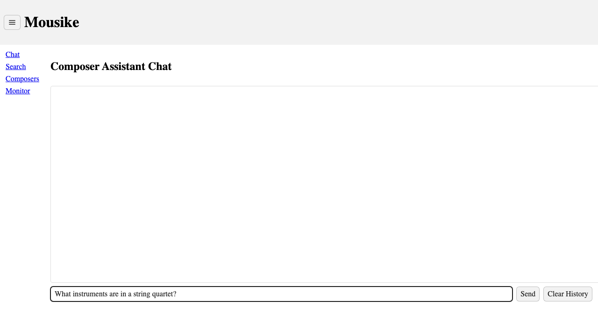
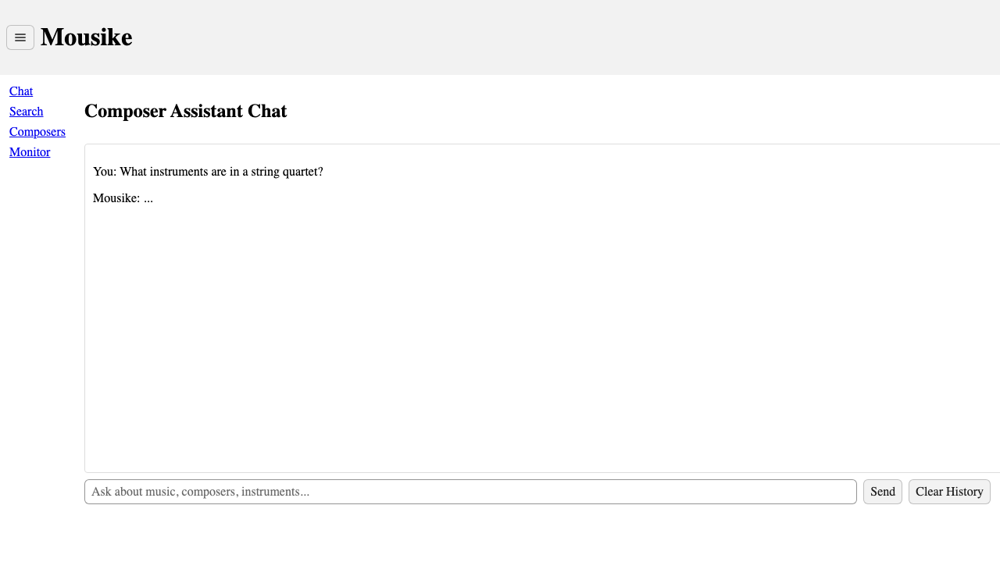
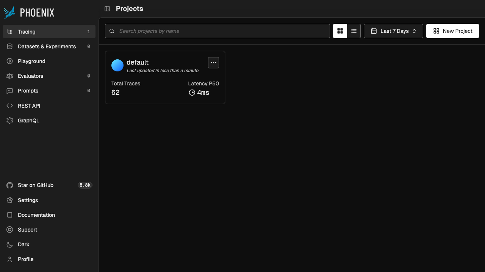
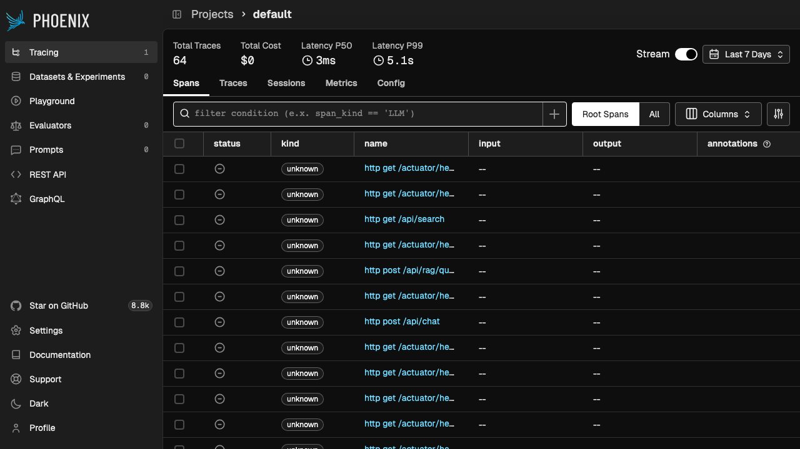
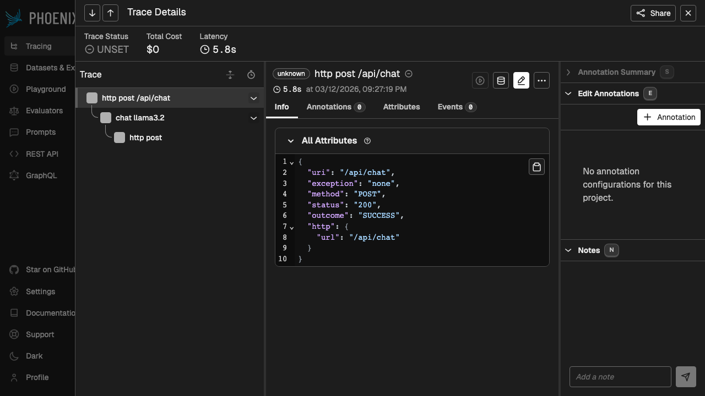
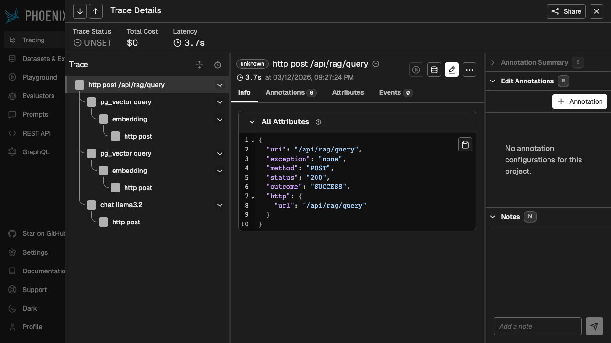

# Mousike — Product & User Manual

> **Mousike** (Greek: μουσική, "music") is an AI-powered music assistant built with Spring Boot, Spring AI, and Vaadin. It uses Retrieval-Augmented Generation (RAG) with a Model Context Protocol (MCP) architecture to answer questions about music, composers, instruments, and music theory — grounded in your own uploaded documents.

---

## Table of Contents

1. [System Overview](#1-system-overview)
2. [Architecture](#2-architecture)
3. [Getting Started](#3-getting-started)
4. [Web UI Guide](#4-web-ui-guide)
   - [Chat View](#41-chat-view)
   - [Search View](#42-search-view)
   - [Composer Extraction View](#43-composer-extraction-view)
   - [Monitor View](#44-monitor-view)
5. [REST API Reference](#5-rest-api-reference)
6. [Document Ingestion](#6-document-ingestion)
7. [RAG Modes Explained](#7-rag-modes-explained)
8. [Anti-Hallucination Guardrails](#8-anti-hallucination-guardrails)
9. [Observability & Monitoring](#9-observability--monitoring)
10. [Configuration Reference](#10-configuration-reference)
11. [Troubleshooting](#11-troubleshooting)

---

## 1. System Overview

Mousike is a platform for music knowledge management and AI-assisted Q&A. It consists of:

| Component | Purpose | Port |
|---|---|---|
| **mousike-app** | Main application — UI, Chat, RAG, Classification, Extraction | `8080` |
| **document-service** | MCP Server — Document ingestion, vector search tools | `8091` |
| **PostgreSQL + PGVector** | Database — entities + vector embeddings | `5432` |
| **Ollama** | LLM engine — `llama3.2` (chat) + `nomic-embed-text` (embeddings) | `11434` |
| **Phoenix** | LLM observability — trace visualization | `6006` |
| **Grafana LGTM** | Infrastructure observability — metrics, logs, traces | `3000` |

### Technology Stack

- **Backend**: Spring Boot 4.0.3, Spring AI 2.0.0-M2, Java 21
- **UI**: Vaadin 25.0.5 (server-side Java UI framework)
- **LLM**: Ollama (local, running on host machine)
- **Vector Store**: PGVector with HNSW index, cosine distance, 768 dimensions
- **Chat Memory**: JDBC-backed (PostgreSQL), 20-message sliding window per conversation
- **MCP**: HTTP+SSE transport between mousike-app (client) and document-service (server)
- **Deployment**: Kubernetes (Kind cluster), namespace `rag`

---

## 2. Architecture

```
┌─────────────────────────────────────────────────────────────────┐
│                        User (Browser)                           │
│                                                                 │
│   ┌──────────┐  ┌──────────┐  ┌──────────┐  ┌──────────┐     │
│   │   Chat   │  │  Search  │  │ Composer  │  │ Monitor  │     │
│   │   View   │  │   View   │  │   View    │  │   View   │     │
│   └────┬─────┘  └────┬─────┘  └────┬─────┘  └────┬─────┘     │
└────────┼──────────────┼─────────────┼─────────────┼────────────┘
         │              │             │             │
    ┌────▼──────────────▼─────────────▼─────────────▼────────────┐
    │                    mousike-app (:8080)                      │
    │                                                             │
    │  ┌─────────┐ ┌──────────┐ ┌───────────┐ ┌──────────────┐  │
    │  │ChatSvc  │ │SemanticSvc│ │Classify/  │ │ RAG Services │  │
    │  │(Stream) │ │(VectorDB)│ │Extract    │ │Naive/Adv/Agnt│  │
    │  └───┬─────┘ └────┬─────┘ └─────┬─────┘ └──────┬───────┘  │
    │      │             │             │              │           │
    │  ┌───▼─────────────▼─────────────▼──────────────▼────────┐ │
    │  │              Spring AI ChatClient                     │ │
    │  │    ┌─────────────┐  ┌────────────┐  ┌──────────────┐ │ │
    │  │    │ Chat Memory │  │QuestionAnswer│ │  MCP Tool    │ │ │
    │  │    │  Advisor    │  │  Advisor    │  │  Callbacks   │ │ │
    │  │    └──────┬──────┘  └─────┬──────┘  └──────┬───────┘ │ │
    │  └───────────┼───────────────┼─────────────────┼─────────┘ │
    └──────────────┼───────────────┼─────────────────┼───────────┘
                   │               │                 │
         ┌─────────▼───┐  ┌───────▼──────┐  ┌───────▼───────────┐
         │  Ollama LLM │  │  PGVector    │  │  document-service │
         │  llama3.2   │  │  (Postgres)  │  │  MCP Server(:8091)│
         │  nomic-embed│  │  768-dim     │  │  ┌─────────────┐  │
         │  (:11434)   │  │  HNSW/Cosine │  │  │MusicKnowledge│ │
         └─────────────┘  └──────────────┘  │  │   Tools     │  │
                                             │  └──────┬──────┘  │
                                             │         │         │
                                             │  ┌──────▼──────┐  │
                                             │  │Tika Reader  │  │
                                             │  │TokenSplitter│  │
                                             │  │PGVector     │  │
                                             │  └─────────────┘  │
                                             └───────────────────┘
```

### Data Flow

1. **Document Ingestion**: PDF/DOCX → Tika parsing → Token splitting → Ollama embedding (768-dim) → PGVector storage
2. **Semantic Search**: User query → Ollama embedding → PGVector cosine similarity → Ranked results
3. **RAG Query**: User question → Embedding → Vector search → Context injection → Ollama LLM → Grounded answer
4. **Chat**: User message → Chat memory (JDBC) → Ollama LLM → Streamed response → Memory update
5. **Agentic RAG**: User question → Ollama decides tools → MCP call to document-service → Tool results → Ollama generates answer

---

## 3. Getting Started

### Prerequisites

- **Ollama** installed and running on host machine with models:
  ```bash
  ollama pull llama3.2
  ollama pull nomic-embed-text
  ```
- **Kind** (Kubernetes in Docker) installed
- **kubectl** configured
- **Java 21** and **Gradle 8.14+**

### Quick Start (Kind Cluster)

```bash
# 1. Create the Kind cluster
kind create cluster --config k8s/kind-config.yaml

# 2. Create namespace and apply configs
kubectl create namespace rag
kubectl apply -f k8s/configmap.yaml
kubectl apply -f k8s/secrets.yaml

# 3. Build and load images
./gradlew :mousike:bootBuildImage --imageName=mousike-app:latest -Pvaadin.productionMode=true
./gradlew :document-service:bootBuildImage --imageName=document-service:latest
kind load docker-image mousike-app:latest --name mousike-cluster
kind load docker-image document-service:latest --name mousike-cluster

# 4. Deploy infrastructure
kubectl apply -f k8s/postgres/
kubectl apply -f k8s/redis/
kubectl apply -f k8s/docling/
kubectl apply -f k8s/phoenix/
kubectl apply -f k8s/grafana/

# 5. Deploy applications
kubectl apply -f k8s/document-service/
kubectl apply -f k8s/mousike/

# 6. Verify all pods are running
kubectl get pods -n rag
```

### Access Points

Once deployed, access the following URLs in your browser:

| Service | URL | Purpose |
|---|---|---|
| Mousike UI | http://localhost:8080 | Main application |
| Document Service | http://localhost:8091 | Document ingestion API |
| Phoenix | http://localhost:6006 | LLM trace viewer |
| Grafana | http://localhost:3000 | Metrics/logs/traces dashboard |

---

## 4. Web UI Guide

The Mousike UI is a Vaadin-based single-page application with a sidebar navigation drawer. Click the hamburger menu (☰) at the top-left to expand the navigation.

### Navigation

The sidebar provides links to four views:

- **Chat** — Conversational AI assistant
- **Search** — Semantic vector search
- **Composers** — Structured data extraction
- **Monitor** — Observability dashboard links


---

### 4.1 Chat View

**Route**: http://localhost:8080/chat

The Chat view provides a conversational interface to Mousike, the music AI assistant. It supports multi-turn conversations with persistent memory.


**How to use:**

1. Type your question in the text field at the bottom (placeholder: *"Ask about music, composers, instruments..."*)
2. Press **Enter** or click the **Send** button
3. The assistant's response will stream token-by-token into the message area
4. Continue the conversation — Mousike remembers your previous messages (up to 20 messages)
5. Click **Clear History** to reset the conversation





**Features:**
- **Streaming responses**: Tokens appear in real-time as the LLM generates them
- **Conversation memory**: JDBC-backed, persists across page refreshes within the same session
- **20-message window**: Older messages are automatically dropped to stay within context limits
- **Unique conversation ID**: Each browser session gets its own conversation thread

**Example questions to try:**
- "What is a sonata form?"
- "Tell me about Beethoven's late string quartets"
- "What's the difference between a violin and a viola?"
- "Explain the circle of fifths"

---

### 4.2 Search View

**Route**: http://localhost:8080/search

The Search view performs semantic vector search over your ingested document library. Unlike keyword search, it finds documents by meaning — so searching for "stringed instruments played with a bow" will find content about violins even if the word "bow" doesn't appear.


**How to use:**

1. Enter a search query in the **Query** field
2. Optionally select a **Category** filter from the dropdown:
   - *(empty)* — Search all categories
   - `composers` — Composer biographies and works
   - `instruments` — Instrument descriptions
   - `theory` — Music theory concepts
   - `history` — Music history
   - `genres` — Musical genres
3. Click the **Search** button
4. Results appear in the grid below, showing:
   - **Content**: Truncated document text (first 200 characters)
   - **Metadata**: Source filename, category, distance score, chunk info


**Understanding results:**
- **Distance score**: Lower = more similar (0.0 = perfect match, 1.0 = completely different)
- Results are filtered by a similarity threshold of 0.6 (only relevant results shown)
- Maximum 5 results returned per search

---

### 4.3 Composer Extraction View

**Route**: http://localhost:8080/composer

The Composer Extraction view uses the LLM to extract structured data from unstructured text about composers. Paste any text about a composer, and the system will extract key facts into a structured JSON format.


**How to use:**

1. Paste or type text about a composer into the text area
2. Click the **Extract** button
3. The extracted structured data appears below in JSON format

**Example input:**
```
Ludwig van Beethoven was born in Bonn, Germany in 1770. He composed
9 symphonies, 5 piano concertos, and 1 opera called Fidelio. He
became deaf in his later years but continued composing masterworks.
He died in Vienna in 1827.
```

**Example output:**
```json
{
  "name": "Ludwig van Beethoven",
  "birthYear": 1770,
  "deathYear": 1827,
  "nationality": "German",
  "era": "Classical/Romantic",
  "notableWorks": ["Symphony No. 9", "Fidelio", "Piano Concerto No. 5"],
  "instruments": ["Piano"]
}
```

**Extracted fields:**
| Field | Type | Description |
|---|---|---|
| `name` | String | Full name of the composer |
| `birthYear` | Integer | Year of birth |
| `deathYear` | Integer | Year of death (null if alive) |
| `nationality` | String | Country of origin |
| `era` | String | Musical era (Baroque, Classical, Romantic, etc.) |
| `notableWorks` | Array | List of major compositions |
| `instruments` | Array | Instruments the composer was known for |

---

### 4.4 Monitor View

**Route**: http://localhost:8080/monitor

The Monitor view provides quick links to the observability dashboards for the platform.


**Available links:**

| Link | URL | Description |
|---|---|---|
| **Phoenix - LLM Traces** | http://localhost:6006 | View LLM call traces, latencies, token counts |
| **Grafana - Metrics/Logs/Traces** | http://localhost:3000 | Full observability stack (Prometheus, Tempo, Loki) |
| **Health Check** | /actuator/health | Application health status with component details |

---

## 5. REST API Reference

All API endpoints are served by `mousike-app` at `http://localhost:8080`.

### 5.1 Chat API

#### POST /api/chat — Send a chat message

```bash
curl -X POST http://localhost:8080/api/chat \
  -H "Content-Type: application/json" \
  -d '{
    "message": "What is a fugue?",
    "conversationId": "my-session-1"
  }'
```

**Request body:**

| Field | Type | Required | Description |
|---|---|---|---|
| `message` | string | Yes | The user's message |
| `conversationId` | string | No | Conversation thread ID (auto-generated if omitted) |

**Response (200 OK):**
```json
{
  "response": "A fugue is a contrapuntal composition technique...",
  "conversationId": "my-session-1"
}
```

**Error (400 Bad Request):**
```json
{
  "error": "message is required"
}
```

#### POST /api/chat/stream — Stream a chat response (SSE)

Same request body as `/api/chat`. Returns `text/event-stream` with tokens streamed in real-time.

```bash
curl -N -X POST http://localhost:8080/api/chat/stream \
  -H "Content-Type: application/json" \
  -d '{"message": "Explain counterpoint", "conversationId": "stream-1"}'
```

#### DELETE /api/chat/{conversationId} — Clear conversation history

```bash
curl -X DELETE http://localhost:8080/api/chat/my-session-1
```

**Response**: `204 No Content`

---

### 5.2 RAG API

#### POST /api/rag/query — Ask a RAG-powered question

```bash
curl -X POST "http://localhost:8080/api/rag/query?mode=advanced" \
  -H "Content-Type: application/json" \
  -d '{"question": "Who composed the Brandenburg Concertos?"}'
```

**Query parameters:**

| Parameter | Default | Options | Description |
|---|---|---|---|
| `mode` | `advanced` | `naive`, `advanced`, `agentic` | RAG strategy (see [Section 7](#7-rag-modes-explained)) |
| `conversationId` | `default` | Any string | Conversation context (used in agentic mode) |

**Request body:**

| Field | Type | Required | Description |
|---|---|---|---|
| `question` | string | Yes | The question to answer |

**Response (200 OK):**
```json
{
  "question": "Who composed the Brandenburg Concertos?",
  "answer": "Johann Sebastian Bach composed the Brandenburg Concertos...",
  "mode": "advanced"
}
```

**Anti-hallucination response** (when no relevant documents found):
```json
{
  "question": "What is the population of Tokyo?",
  "answer": "I don't have enough information in my knowledge base to answer that question accurately. Please try rephrasing your question or ask about a different music topic.",
  "mode": "naive"
}
```

---

### 5.3 Semantic Search API

#### GET /api/search — Vector similarity search

```bash
curl "http://localhost:8080/api/search?q=baroque+composers&category=composers&topK=5"
```

**Query parameters:**

| Parameter | Required | Default | Description |
|---|---|---|---|
| `q` | Yes | — | Search query text |
| `category` | No | *(all)* | Filter: `composers`, `instruments`, `theory`, `history`, `genres` |
| `topK` | No | `5` | Maximum number of results |

**Response (200 OK):**
```json
[
  {
    "content": "Johann Sebastian Bach (1685-1750) was a German composer...",
    "metadata": {
      "source": "test-composers-guide.pdf",
      "category": "composers",
      "distance": 0.28148636,
      "chunk_index": 0,
      "ingested_at": 1773359968409
    }
  }
]
```

---

### 5.4 Classification API

#### POST /api/classify — Classify a musical instrument

```bash
curl -X POST http://localhost:8080/api/classify \
  -H "Content-Type: application/json" \
  -d '{"description": "A large wooden instrument with 88 black and white keys"}'
```

**Request body:**

| Field | Type | Required | Description |
|---|---|---|---|
| `description` | string | Yes | Natural language description of the instrument |

**Response (200 OK):**
```json
{
  "classification": "{\"category\": \"KEYBOARD\", \"confidence\": 0.95, \"reasoning\": \"88 keys is characteristic of a piano\"}"
}
```

**Classification categories:** `STRING`, `WOODWIND`, `BRASS`, `PERCUSSION`, `KEYBOARD`, `ELECTRONIC`, `VOCAL`

---

### 5.5 Extraction API

#### POST /api/extract — Extract composer data from text

```bash
curl -X POST http://localhost:8080/api/extract \
  -H "Content-Type: application/json" \
  -d '{"text": "Mozart was born in Salzburg in 1756 and composed The Magic Flute"}'
```

**Request body:**

| Field | Type | Required | Description |
|---|---|---|---|
| `text` | string | Yes | Unstructured text about a composer |

**Response (200 OK):**
```json
{
  "extraction": "{\"name\": \"Wolfgang Amadeus Mozart\", \"birthYear\": 1756, \"deathYear\": 1791, \"nationality\": \"Austrian\", \"era\": \"Classical\", \"notableWorks\": [\"The Magic Flute\"], \"instruments\": [\"Piano\", \"Violin\"]}"
}
```

---

### 5.6 Document Ingestion API (document-service)

#### POST http://localhost:8091/api/ingest — Upload and ingest a document

```bash
curl -X POST http://localhost:8091/api/ingest \
  -F "file=@my-music-book.pdf" \
  -F "category=theory"
```

**Form fields:**

| Field | Type | Required | Default | Description |
|---|---|---|---|---|
| `file` | file | Yes | — | PDF, DOCX, or TXT file |
| `category` | string | No | `general` | Category tag for filtering |

**Response (200 OK):**
```json
{
  "filename": "my-music-book.pdf",
  "chunksIngested": 12,
  "success": true,
  "error": ""
}
```

**Supported file formats:** PDF, DOCX, DOC, TXT, RTF, HTML (via Apache Tika)

#### GET http://localhost:8091/api/documents — List available documents

```bash
curl http://localhost:8091/api/documents
```

---

### 5.7 Health & Metrics

| Endpoint | Description |
|---|---|
| `GET /actuator/health` | Full health status with component details |
| `GET /actuator/health/readiness` | Kubernetes readiness probe |
| `GET /actuator/health/liveness` | Kubernetes liveness probe |
| `GET /actuator/prometheus` | Prometheus metrics (gen_ai, JVM, HTTP, PGVector) |
| `GET /actuator/info` | Application info |
| `GET /actuator/metrics` | Micrometer metrics list |

---

## 6. Document Ingestion

Before RAG and semantic search can work, you need to ingest documents into the vector store.

### Ingestion Pipeline

```
PDF/DOCX file
    │
    ▼
┌─────────────────┐
│  Apache Tika    │  ← Parses any document format into text
│  DocumentReader │
└────────┬────────┘
         │
         ▼
┌─────────────────┐
│  TokenText      │  ← Splits long documents into overlapping chunks
│  Splitter       │
└────────┬────────┘
         │
         ▼
┌─────────────────┐
│  Metadata       │  ← Adds: source filename, category, timestamp
│  Enrichment     │
└────────┬────────┘
         │
         ▼
┌─────────────────┐
│  Ollama         │  ← Generates 768-dimensional embedding vectors
│  nomic-embed    │
└────────┬────────┘
         │
         ▼
┌─────────────────┐
│  PGVector       │  ← Stores vectors with HNSW index for fast search
│  (PostgreSQL)   │
└─────────────────┘
```

### How to Ingest Documents

**Via curl:**
```bash
# Ingest a PDF about music theory
curl -X POST http://localhost:8091/api/ingest \
  -F "file=@music-theory-textbook.pdf" \
  -F "category=theory"

# Ingest a DOCX about composers
curl -X POST http://localhost:8091/api/ingest \
  -F "file=@composer-biographies.docx" \
  -F "category=composers"
```

**Via Kubernetes Job** (bulk ingestion at deployment):
```bash
kubectl apply -f k8s/ingester/job.yaml
```

### Category Tags

Use consistent category tags to enable filtered searching:

| Category | Use for |
|---|---|
| `composers` | Biographies, works, historical context |
| `instruments` | Instrument descriptions, techniques, families |
| `theory` | Scales, harmony, counterpoint, form analysis |
| `history` | Musical periods, movements, cultural context |
| `genres` | Jazz, classical, rock, folk, electronic |
| `general` | Everything else (default) |

---

## 7. RAG Modes Explained

Mousike offers three RAG (Retrieval-Augmented Generation) strategies, each with different trade-offs:

### Naive RAG

**API**: `POST /api/rag/query?mode=naive`

The simplest RAG approach. Directly searches the vector store and feeds results to the LLM.

```
Question → Embed → PGVector Search (top 5, threshold 0.50)
    → Retrieval Gate Check
    → LLM Generation with QuestionAnswerAdvisor
    → Output Validation
    → Answer
```

**Best for**: Simple factual questions with clear answers in the documents.

### Advanced RAG

**API**: `POST /api/rag/query?mode=advanced`

Enhanced retrieval with stricter thresholds and Spring AI's QuestionAnswerAdvisor for better context injection.

```
Question → Embed → PGVector Search (top 10, threshold 0.65)
    → Retrieval Gate Check (min 2 chunks)
    → QuestionAnswerAdvisor (auto context injection)
    → LLM Generation with grounding system prompt
    → Output Validation (30% grounding ratio)
    → Answer
```

**Best for**: Complex questions requiring multiple document sources. Default mode.

### Agentic RAG

**API**: `POST /api/rag/query?mode=agentic`

LLM-driven retrieval via MCP tool calls. The LLM decides what to search for, can refine queries, and call multiple tools.

```
Question → LLM decides tools to call
    → MCP Tool Call: searchMusicKnowledge / searchByCategory / listAvailableDocuments
    → document-service executes tool → PGVector search
    → Results returned to LLM
    → LLM may call additional tools or generate answer
    → Answer
```

**Available MCP Tools:**
| Tool | Description |
|---|---|
| `searchMusicKnowledge` | General knowledge search with configurable topK and minScore |
| `searchByCategory` | Category-filtered search (composers, instruments, theory, etc.) |
| `listAvailableDocuments` | Lists available knowledge sources |

**Best for**: Exploratory questions where the best search strategy isn't obvious. The LLM can adaptively search and refine.

---

## 8. Anti-Hallucination Guardrails

Mousike implements a **3-layer defense** against hallucination in RAG responses:

### Layer 1: Retrieval Gate

Before calling the LLM, the system checks if sufficient relevant context was found:

- **Minimum similarity score**: 0.65 (cosine distance)
- **Minimum chunk count**: 2 documents must be retrieved
- If either condition fails → the LLM is **never called** → returns a safe "no data" response

### Layer 2: System Prompt

The LLM is instructed via system prompt:
> *"Answer based ONLY on the retrieved context. If context is insufficient, say so. Cite sources."*

### Layer 3: Output Validation

After the LLM generates a response, it is validated:

- **Grounding ratio check**: At least 30% of content words in the response must appear in the retrieved documents
- **Refusal detection**: Valid refusals (e.g., "I don't know") are accepted without grounding check
- **Blank check**: Empty responses are rejected

**If any layer fails**, the user receives:
> *"I don't have enough information in my knowledge base to answer that question accurately. Please try rephrasing your question or ask about a different music topic."*

---

## 9. Observability & Monitoring

### Phoenix — LLM Trace Viewer

**URL**: http://localhost:6006



Phoenix provides AI-specific observability:
- **Trace visualization**: See every LLM call with full call stack
- **Latency tracking**: P50/P99 latency for LLM calls and overall traces
- **Span hierarchy**: Parent-child span relationships showing the complete message flow
- **Projects**: Traces organized into the "default" project

#### Traces List

Click the "default" project to see all traces:



#### Chat Trace — LLM Call Stack

Click on an `http post /api/chat` trace to see the full call stack:



The chat trace shows three levels:
1. **`http post /api/chat`** — incoming HTTP request (root span)
2. **`chat llama3.2`** — Spring AI calling the Ollama LLM
3. **`http post`** — raw HTTP call to Ollama API

#### RAG Trace — Full Retrieval Pipeline

The RAG trace is the most comprehensive, showing the entire retrieval-augmented generation pipeline:



The RAG trace shows:
1. **`http post /api/rag/query`** — incoming request (root)
2. **`pg_vector query`** → **`embedding`** → **`http post`** — vector similarity search (query embedding + PGVector lookup)
3. **`chat llama3.2`** → **`http post`** — LLM generates answer from retrieved context

This demonstrates the complete flow: **question → embed → search → retrieve → generate → respond**.

### Grafana — Full Observability Stack

**URL**: http://localhost:3000 (login: `admin` / `admin`)


Grafana LGTM provides four pre-configured datasources:

| Datasource | Purpose |
|---|---|
| **Prometheus** | Metrics — JVM, HTTP, Spring AI gen_ai, PGVector operations |
| **Tempo** | Distributed traces — request flow across services |
| **Loki** | Log aggregation — centralized log search |
| **Pyroscope** | Continuous profiling |

#### Key Metrics to Monitor

Navigate to **Grafana → Explore** and select a datasource:

**Prometheus metrics** (select Prometheus datasource):


| Metric | Description |
|---|---|
| `gen_ai_client_operation_seconds_count{gen_ai_operation_name="chat"}` | Total LLM chat calls |
| `gen_ai_client_operation_seconds_count{gen_ai_operation_name="embedding"}` | Total embedding calls |
| `gen_ai_client_operation_seconds_sum{gen_ai_operation_name="chat"}` | Total LLM chat latency |
| `db_vector_client_operation_seconds_count{db_system="pg_vector"}` | PGVector query count |
| `http_server_requests_seconds_count` | HTTP request count by endpoint |
| `jvm_memory_used_bytes` | JVM memory usage |

**Tempo traces** (select Tempo datasource):


Search for traces by service name `mousike` to see distributed traces across the full call chain.

### Prometheus Metrics Endpoint

Direct access to raw metrics:
```bash
curl http://localhost:8080/actuator/prometheus
```

### Health Check

```bash
curl http://localhost:8080/actuator/health | jq
```

Returns component-level health including database, disk space, and readiness/liveness status.

---

## 10. Configuration Reference

### Environment Variables

| Variable | Default | Description |
|---|---|---|
| `SPRING_DATASOURCE_URL` | `jdbc:postgresql://localhost:5432/mousike` | PostgreSQL connection URL |
| `POSTGRES_USER` | `mousike` | Database username |
| `POSTGRES_PASSWORD` | `mousike-secret` | Database password |
| `SPRING_AI_OLLAMA_BASE_URL` | `http://localhost:11434` | Ollama API endpoint |
| `DOCUMENT_SERVICE_URL` | `http://localhost:8090` | Document service base URL |
| `GRAFANA_OTLP_HTTP_URL` | `http://localhost:4318` | Grafana OTLP HTTP endpoint |
| `PHOENIX_OTLP_HTTP_URL` | `http://localhost:6006` | Phoenix OTLP HTTP endpoint |

### LLM Configuration

| Setting | Value | Description |
|---|---|---|
| Chat model | `llama3.2` | Ollama model for text generation |
| Embedding model | `nomic-embed-text` | Ollama model for embeddings |
| Temperature | `0.7` | Creativity/randomness (0.0–1.0) |
| Top-P | `0.9` | Nucleus sampling threshold |
| Context window | `4096` tokens | Maximum input context |
| Embedding dimensions | `768` | Vector size for nomic-embed-text |

### Vector Store Configuration

| Setting | Value |
|---|---|
| Index type | HNSW (Hierarchical Navigable Small World) |
| Distance metric | Cosine distance |
| Dimensions | 768 |
| Table | `public.vector_store` |
| Max batch size | 10,000 documents |

---

## 11. Troubleshooting

### "I don't have enough information" for every RAG question

**Cause**: No documents ingested, or documents don't meet the retrieval gate thresholds.

**Fix**:
1. Ingest documents: `curl -X POST http://localhost:8091/api/ingest -F "file=@yourfile.pdf" -F "category=theory"`
2. Verify with search: `curl "http://localhost:8080/api/search?q=your+topic&topK=10"`
3. For the retrieval gate to pass, at least 2 chunks with similarity > 0.65 must be found

### Chat doesn't remember previous messages

**Cause**: Different `conversationId` being sent, or memory was cleared.

**Fix**: Ensure you pass the same `conversationId` in every request within a conversation. The UI handles this automatically.

### Ollama connection refused

**Cause**: Ollama not running, or wrong base URL.

**Fix**:
1. Verify Ollama is running: `curl http://localhost:11434/api/tags`
2. Check the models are pulled: `ollama list` (should show `llama3.2` and `nomic-embed-text`)
3. In K8s, pods access Ollama via `host.docker.internal:11434`

### Pods stuck in CrashLoopBackOff

**Fix**:
1. Check logs: `kubectl logs deployment/mousike -n rag`
2. Check init containers: `kubectl describe pod <pod-name> -n rag`
3. Common causes: PostgreSQL not ready, Ollama not reachable, Redis not running

### Search returns empty results

**Cause**: Query doesn't match ingested content semantically, or similarity threshold too high.

**Fix**: Use broader, more descriptive queries. Single-word queries may not reach the 0.6 similarity threshold. Try multi-word phrases like "classical music composers Bach Beethoven" instead of just "Bach".
